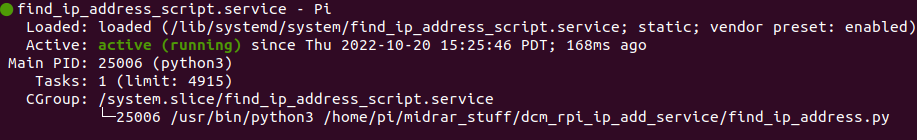

## Description:

This script gets the IP address of the current machine and sends it over to a remote host. The remote host is the white Linux computer that Midrar is working on right now.

### Note:

**Contact Midrar to get Linux computer ip, hostname, and password**
**midrar@pdx.edu**

## Requirements:
- Before starting the setup process, type the following two commands on your terminal:
    - ```sudo apt update```
    - ```sudo apt upgrade```
- Install pip using the following command:
    - ```sudo apt install python3-pip```
- Install bcrypt using the following command:
    - ```sudo pip3 install -U "bcrypt<4.0.0"```
- Install paramiko using the following command:
    - ```sudo pip3 install paramiko```

## How to create a service?

- Type the following command to start creating a service:
    - ```sudo nano /etc/systemd/system/find_ip.service```
    - **DO NOT USE /lib/systemd/system/**
    - In the name field, write the name of the service that will be created.
- Within the service file, paste the following:
```
[Unit]
Description=this service will send the ip address on every boot.
After=network.target
[Service]
ExecStart=/usr/bin/python3 [PATH-TO-find_ip_address.py-SCRIPT]
[Install]
WantedBy=multi-user.target
```
- Change [PATH TO PYTHON SCRIPT] to the path where the Python script is located on your machine.
    - You can get the path where the Python script is located by typing the following command:
        - ```pwd```
- Save and exit the service file.
- To run the service, type the following command:
    - ```sudo systemctl enable find_ip.service```
    - ```sudo systemctl start find_ip.service```

Once done, you should the following output indicating that the service is working:

